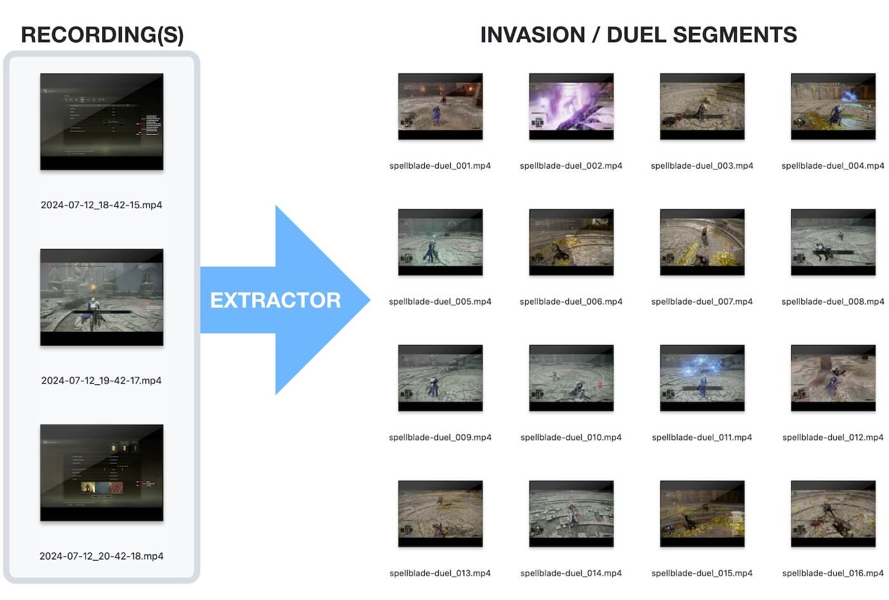

# Elden Ring Invasion Studio

Invasion Studio finds invasions and arena encounters in Elden Ring recordings,
extracts them as individual clips, and provides a local WebUI for reviewing,
organizing, trimming, and exporting them. Clips cut elsewhere can be uploaded
straight into the WebUI, so the library is not limited to extractor output.


## Install

Invasion Studio requires Ruby 3.3 or newer, ffmpeg, and Tesseract OCR.

```bash
# macOS
brew install ffmpeg tesseract

# Ubuntu/Debian
sudo apt-get install ffmpeg tesseract-ocr

# Arch Linux
sudo pacman -S ffmpeg tesseract tesseract-data-eng
```

Install the gem:

```bash
gem install invasion-studio
```

## Quick usage

The normal workflow has two steps.

### 1. Generate clips into a new folder

Choose a new output folder and pass one or more gameplay recordings:

```bash
invasion-studio extract \
  --outdir ~/Videos/ER/my-invasion-project \
  ~/Videos/Capture/*.mp4
```

The output folder is created automatically. Each detected encounter becomes an
MP4 clip inside it.

Once a project exists, later extractions can target it directly:

```bash
invasion-studio extract \
  --project ~/Videos/ER/my-invasion-project \
  ~/Videos/Capture/*.mp4
```

`--project` writes the clips into the project's `clips/` folder as
`clip_00022.mp4`, `clip_00023.mp4`, ... (continuing from the highest existing
number) and registers them in `project.db` right away, with the source
recording stored as provenance. Thumbnails are generated the next time the
WebUI starts.

If OBS split one recording into several files, pass them together in
chronological order. Invasions spanning two files are joined automatically.



### 2. Start the WebUI with that folder

```bash
invasion-studio webui ~/Videos/ER/my-invasion-project
```

Open [http://localhost:4567](http://localhost:4567). All project metadata
lives in a SQLite database (`project.db`) inside the selected folder; projects
created by versions before 0.6.0 (`project.json`) are migrated automatically
the first time they are opened.

From the WebUI you can:

- preview clips and switch audio tracks;
- add titles, notes, ratings, results, and tags;
- search the library and filter by tag, rating, or result;
- upload clips;
- organize clips into compilations and reorder them by drag & drop;
- mark unwanted sections for removal;
- move clips to the trash, restore them, or empty the trash for good;
- export a compilation as a combined video and Kdenlive project.

To use another port:

```bash
invasion-studio webui --port 8080 ~/Videos/ER/my-invasion-project
```

Desktop launchers can request an OS-selected port and monitor their sidecar:

```bash
invasion-studio --quiet webui --port 0 --parent-pid "$launcher_pid" ~/Videos/ER/my-invasion-project
```

Once listening, the command writes a JSON line such as
`{"event":"ready","port":49152}` to standard output. `GET /api/health`
returns the application version and current project state. SIGTERM shuts the
server down cleanly, and `--parent-pid` stops it if its launcher disappears.

Packaged applications may set `INVASION_STUDIO_FFMPEG`,
`INVASION_STUDIO_FFPROBE`, and `INVASION_STUDIO_TESSERACT` to absolute tool
paths. When unset, the usual `PATH` lookup is used.

## Project folder layout

A project is a plain folder. Everything Invasion Studio knows about it lives
inside:

```text
my-invasion-project/
├── clips/            clips added through the WebUI upload
├── thumbnails/       generated preview thumbnails
├── exports/          combined videos and Kdenlive projects
├── .trashed/         clips moved to the trash (until the trash is emptied)
└── project.db        SQLite database: titles, notes, ratings, tags,
                      compilations, cut markers
```

The video files stay ordinary files — deleting `project.db` loses the metadata
but never the clips. Video files copied into the folder by hand are picked up
the next time the WebUI starts.

### Uploading clips

The **Upload** button in the WebUI accepts one or more video files
(`.mp4`, `.mkv`, `.mov`, `.avi`, `.webm`, `.flv`, `.m4v`, `.mpeg`, `.mpg`,
up to 4 GB each). Files are validated with ffprobe before they enter the
library, stored under `clips/`, and get a preview thumbnail generated in the
background. Files that fail validation are reported individually and the rest
of the batch is imported normally.

## How detection works

The extractor samples the game-text area and uses OCR to find these messages:

- Start: `Defeat … Host of Fingers` or `Commencing combat`
- End: `Returning to your world` or `Combat ends`

Clips include 10 seconds before the detected start and 7.5 seconds after the
detected end by default.

## Other commands

```bash
# Show detected timestamps without creating clips
invasion-studio scan ~/Videos/Capture/*.mp4

# Join every clip in a folder and add chapter markers
invasion-studio concat ~/Videos/ER/my-invasion-project

# Build a combined video and Kdenlive project directly
invasion-studio export-kdenlive ~/Videos/ER/my-invasion-project

# Rename a project's clips to clip_00001.mp4, clip_00002.mp4, ...
# (updates the database, thumbnails, compilations, tags, and cuts;
#  stop the WebUI first, use --dry-run to preview)
invasion-studio normalize ~/Videos/ER/my-invasion-project

# Copy existing clips into a project as clip_00001.ext, clip_00002.ext, ...
invasion-studio import --project ~/Videos/ER/my-invasion-project ~/Videos/Clips/*.{mp4,mkv}

# Show global or command-specific help
invasion-studio --help
invasion-studio extract --help
```

Commands:

| Command | Purpose |
|---|---|
| `extract` | Detect encounters and create clips; this is the default command |
| `scan` | Detect encounters without creating clips |
| `webui` | Start the local project WebUI |
| `concat` | Join clips into one chaptered video |
| `export-kdenlive` | Create a combined video and Kdenlive timeline |
| `normalize` | Rename a project's clips to the generic sequential naming |
| `import` | Copy existing clips into a project with sequential naming |

## Useful extraction options

| Option | Default | Purpose |
|---|---:|---|
| `--outdir DIR` | `./invasion_clips` | Folder for generated clips |
| `--prefix NAME` | `invasion` | Generated filename prefix |
| `--project DIR` | — | Extract into a project (`clips/`, `clip_` prefix, DB registration); excludes the two options above |
| `--fps RATE` | `1` | OCR samples per second |
| `--pad-start SEC` | `10` | Extra time before an encounter |
| `--pad-end SEC` | `7.5` | Extra time after an encounter |
| `--no-cache` | off | Reprocess footage without reading or writing OCR cache |
| `--continue-on-error` | off | Continue when one input cannot be processed |
| `--debug` | off | Print matches and write frame OCR to YAML |
| `--ocr-workers N` | up to `4` | Parallel Tesseract workers |
| `--ocr-batch-size N` | `1` | Images handled by one Tesseract process |
| `--hwaccel` | off | Use VAAPI frame extraction when available |

Increasing `--fps` can help with very short messages but increases OCR work
linearly. `--ocr-batch-size 8` reduced CPU use by about 29% on the project test
videos, but improved elapsed time by only 1–2%; it remains an optional tuning
setting rather than the default.

## Cache and troubleshooting

OCR results are cached under:

```text
${XDG_CACHE_HOME:-$HOME/.cache}/invasion-studio
```

Use `--no-cache` when checking changed OCR settings or investigating a missed
encounter.

Detection can be missed when menus or platform overlays cover the game text.
Use `--debug` to inspect the recognized text and matched timestamps.

The extractor is optimized for English footage at 720p, 1080p, or 1440p on
macOS and Linux. A modern browser is required for the WebUI.

## Development

Ruby 3.4.9 and Node.js 24 LTS are pinned in `mise.toml`. The Ruby application,
browser-based WebUI, and Electron desktop shell can be developed separately.

### Initial setup

```bash
# Install Ruby and WebUI asset dependencies.
bundle install
npm ci
bin/build-assets
```

### Develop the Ruby application and WebUI

The standalone WebUI remains a supported workflow and does not require
Electron:

```bash
# Start from the source checkout.
bundle exec bin/invasion-studio webui /path/to/project

# Run the non-video Ruby test suite.
bundle exec rake test

# Build and verify the installable Ruby gem.
bin/build-gem
```

After installing the gem, the same UI remains available with:

```bash
invasion-studio webui /path/to/project
```

Generated WebUI assets under `lib/invasion_studio/webui/public/assets/` are
ignored and should not be committed.

### Develop the Electron desktop application

The Electron project has its own dependency lockfile so ordinary gem
development does not install Electron or Forge:

```bash
# One-time Electron dependency setup.
npm ci --prefix desktop/electron

# Fast Electron security and sidecar tests; these do not process video.
npm test --prefix desktop/electron

# Build the Linux x64 Tebako sidecar.
bin/build-sidecar

# Launch Electron through Forge against a project folder.
INVASION_STUDIO_PROJECT=/path/to/project \
  npm start --prefix desktop/electron
```

Electron only supervises the packaged `invasion-studio webui` process and
loads its local URL. Project, database, media, and WebUI behavior remains in
the Ruby application.

### Build the Linux desktop package

The first desktop release targets Linux x64, with Flatpak as the primary
installer:

```bash
# Rebuild the sidecar, run Electron tests, and create an unpacked app.
bin/build-desktop

# Launch the project picker, or pass a folder to bypass it during development.
bin/run-desktop
bin/run-desktop /path/to/project

# Run the Flatpak maker instead of producing only the unpacked app.
bin/build-desktop --make
```

Build output is ignored under `desktop/electron/out/`. The sidecar is generated
under `pkg/sidecar/linux-x64/`. Empty platform directories reserve the planned
Windows x64 and macOS x64/ARM64 targets, but those packaging pipelines are not
implemented for the first release.

Portable FFmpeg, FFprobe, Tesseract, and trained-data resources are the next
Flatpak packaging gate. Until they are staged under `pkg/tools/linux-x64`, the
desktop development build uses tools available through the host environment.

### Verification and releases

```bash
# Complete suite, including sample-video processing. Run manually.
bin/test

# Gem release gate: assets, non-video tests, gem installation, CLI, and WebUI.
bin/release-check
```

See `RELEASING.md` and `desktop/electron/README.md` for the detailed gates.

## Support

If this tool saves you time, consider supporting development:

[](https://ko-fi.com/bladeofmaya)

You can also follow me for Elden Ring streams, videos, and project updates:

- [Twitch](https://www.twitch.tv/bladeofmaya)
- [YouTube](https://www.youtube.com/@bladeofmaya)

Feel free to stop by and follow!

## License

MIT License — see [MIT-LICENSE](MIT-LICENSE).
