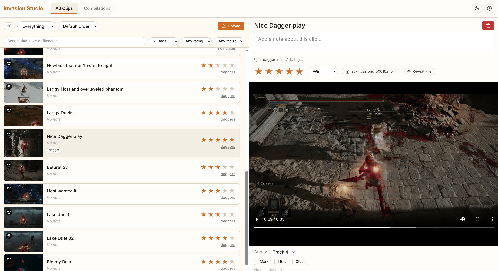

# Elden Ring Invasion Studio

Automatically detect and extract invasion clips from your Elden Ring gameplay footage. This Ruby gem scans your recordings using OCR (Optical Character Recognition) to find invasion start/end points, cuts them into separate video files, and provides a browser-based studio to organize, review, and export them — perfect for content creators who want to streamline their editing workflow.

[📺 Watch the demo](https://www.youtube.com/watch?v=-G9ARNrhMOI)



---

## Quick Start

### Prerequisites

Make sure you have **ffmpeg** and **tesseract** installed:

```bash
# macOS
brew install ffmpeg tesseract

# Ubuntu/Debian
sudo apt-get install ffmpeg tesseract-ocr

# Arch Linux
sudo pacman -S ffmpeg tesseract tesseract-data-eng
```

### Installation

```bash
gem install invasion-studio
```

### Typical Workflow

```bash
# 1. Extract invasions from your recordings
invasion-studio --prefix ps-daggers-tt-04 --outdir ~/Videos/ER/clips ~/Videos/Capture/*.mp4

# 2. Open the Invasion Studio to organize, review, and tag clips
invasion-studio webui ~/Videos/ER/clips

# 3. Export a group to a single video + Kdenlive timeline
# (Done from the studio UI — or via CLI)
invasion-studio export-kdenlive ~/Videos/ER/clips
```

**Pro tip:** If OBS splits your recordings into segments (e.g., 60-minute chunks), pass all files in order. The tool detects invasions that span across files and combines them automatically.

---

## What It Does

This tool reads on-screen text to detect:
- **Invasion Start**: "Defeat [Name], Host of Fingers" / "Commencing combat"
- **Invasion End**: "Returning to your world" / "Combat ends"

It then automatically cuts your video into individual invasion clips, adding a 10-second buffer before the start and 7.5 seconds after the end so you don't miss any action.

---

## Invasion Studio (WebUI)

After extracting clips, organize, review, and export them with the built-in browser-based studio.


### Features

- **Browse & Organize** — View all clips with titles, notes, star ratings, and win/loss/dc tags
- **Groups** — Create groups to organize invasions by theme, build, or session
- **Video Preview** — Watch clips directly in the browser with audio track switching
- **Cut Editor** — Mark start/end cut points and export only the best moments
- **Export** — Export groups as a single spliced video with a Kdenlive timeline project

### How to Run

```bash
# Start the studio from your clips folder
invasion-studio webui ~/Videos/ER/clips

# Start on a custom port
invasion-studio webui -p 8080 ~/Videos/ER/clips

```

Then open `http://localhost:4567` (or your custom port) in your browser.

The installed WebUI is self-contained: its CSS, Stimulus application, and
controllers are packaged in the gem and make no third-party network requests.

---

## Full CLI Reference

### Command Structure

```
invasion-studio [COMMAND] [OPTIONS] [VIDEO_FILES...]
```

### Commands

| Command | Description |
|---------|-------------|
| `extract` | Extract invasion clips (default) |
| `scan` | Scan videos and show timestamps only |
| `webui` | Start the Invasion Studio browser interface |
| `export-kdenlive` | Export clips to a Kdenlive timeline |
| `concat` | Concatenate clips into a single video |

### Complete Flag Reference

#### Extract / Scan Flags

| Flag | Default | Description |
|------|---------|-------------|
| `-h, --help` | — | Show help message and exit |
| `-v, --version` | — | Show version and exit |
| `-d, --debug` | Off | Print debug output and write frame text to YAML |
| `-q, --quiet` | Off | Suppress all non-error output |
| `-p, --prefix PREFIX` | `invasion` | Prefix for output clip filenames |
| `-o, --outdir DIRECTORY` | `./invasion_clips` | Output directory for extracted clips |
| `--fps RATE` | `1` | Frames per second to extract for OCR |
| `--no-cache` | Off | Skip OCR cache and force re-processing |
| `--pad-start SECONDS` | `10.0` | Seconds to include before invasion start |
| `--pad-end SECONDS` | `7.5` | Seconds to include after invasion end |
| `--continue-on-error` | Off | Continue processing remaining videos if one fails |
| `--ffmpeg-threads N` | `4` | ffmpeg encoding threads |
| `--hwaccel` | Off | Enable VAAPI hardware acceleration |

#### Export & WebUI Flags

| Flag | Command | Description |
|------|---------|-------------|
| `-o, --output FILE` | `export-kdenlive`, `concat` | Output file path |
| `-p, --port PORT` | `webui` | Server port (default: 4567) |

### Flag Details

**`--fps RATE`** — Controls how many frames per second are extracted from the video for OCR. The default `1` means one frame every 1 second. Increasing to `2` or `4` improves detection accuracy for very short invasions but increases processing time linearly.

**`--debug`** — Enables two things: (1) prints every matched start/end frame with its exact timestamp and raw OCR text so you can inspect why an invasion was missed, and (2) writes a `<video_hash>.debug.yml` file containing every extracted frame's timestamp and detected text.

**`--hwaccel`** — Enables VAAPI hardware acceleration for faster ffmpeg encoding. Requires a compatible GPU and drivers.

---

## Usage Examples

### Basic Extraction

```bash
# Extract from a single video
invasion-studio video.mp4

# Extract from multiple videos with prefix
invasion-studio --prefix my-invasions ~/Videos/Capture/*.mp4

# Specify output directory
invasion-studio -o ~/Desktop/clips ~/Videos/Capture/*.mp4
```

### Scan Mode (Preview Invasions)

```bash
# Scan only - shows timestamps without extracting
invasion-studio scan ~/Videos/Capture/*.mp4

# Output:
# Detected Invasions:
#   [1] 00:05:30.000 → 00:08:45.500
#       File: 2024-01-15_18-39-00.mp4
#   [2] 00:22:15.000 → 00:25:30.250
#       Cross-file: 2024-01-15_18-39-00.mp4 → 2024-01-15_19-39-00.mp4
#
# Total: 2 invasion(s) detected
```

### Debug Mode

```bash
# See exactly what OCR detected at every timestamp
invasion-studio -d ~/Videos/Capture/*.mp4

# Output includes:
#   [START] 00:01:23.500 => "Defeat the Host of Fingers"
#   [END]   00:02:45.000 => "Returning to your world"
#
# Plus a .debug.yml file with every frame's text
```

### Export & Concatenate

```bash
# Export clips folder to a Kdenlive timeline
invasion-studio export-kdenlive ~/Videos/ER/clips

# Export with a custom output path
invasion-studio export-kdenlive -o ~/Videos/ER/project.kdenlive ~/Videos/ER/clips

# Concatenate all clips into a single video (no re-encoding, with chapter markers)
invasion-studio concat ~/Videos/ER/clips

# Concat with custom output
invasion-studio concat -o ~/Videos/ER/final.mp4 ~/Videos/ER/clips
```

### Cache Management

OCR results follow the XDG Base Directory Specification and are cached in
`${XDG_CACHE_HOME:-$HOME/.cache}/invasion-studio`. To force re-processing:

```bash
# Skip cache for this run
invasion-studio --no-cache ~/Videos/Capture/*.mp4

# Clear the current cache manually
rm -rf "${XDG_CACHE_HOME:-$HOME/.cache}/invasion-studio"
```

### Upgrading from versions before 0.5.0

Version 0.5.0 is a clean, breaking rename. It does not migrate settings or cache
data from Invasion Extractor. The old Linux OCR cache is no longer read and can
be removed manually:

```bash
rm -rf /dev/shm/invasion_extractor_cache
```

This command removes only the obsolete global OCR cache. Do not remove your clip
or project folders; they contain user-created videos and project metadata.

---

## Requirements & Compatibility

The planned behavior-preserving decomposition of the project model, WebUI
server, and Kdenlive exporter is documented in
[REFACTORING-PLAN.md](REFACTORING-PLAN.md).

| Requirement | Details |
|------------|---------|
| **Resolution** | Optimized for 1440p (2560×1440), works at 1080p and 720p |
| **Framerate** | 30fps or 60fps |
| **Platform** | macOS and Linux (tested), Windows should work |
| **Language** | English only (for now) |
| **Ruby** | 3.3+ |
| **Browsers** | Any modern browser (Chrome, Firefox, Safari, Edge) |

### Known Limitations

- **UI Overlays**: PSN quick menu or other overlays covering game text can cause missed detections
- **Text Position**: Invasion text must be visible — if you're in a menu when it appears, detection may fail
- **Performance**: OCR processing averages ~0.18s per frame on CPU. With the default of 1fps, a 60-minute video extracts ~3600 frames. The pipeline now runs extraction and OCR concurrently using a multi-threaded worker pool, and the direct Tesseract CLI call (with a character whitelist) removes Ruby wrapper overhead. On a typical multi-core machine, a 60-minute video processes in roughly 8–12 minutes — a major improvement over earlier versions. Enable `--hwaccel` for even faster encoding on supported GPUs.

---

## Architecture

```
lib/invasion_studio/
├── invasion_studio.rb    # Main entry point, dependency checks
├── cli.rb                   # CLI orchestrator (parses args, dispatches commands)
├── commands/
│   ├── base.rb              # Abstract command base class
│   ├── extract.rb           # Extract/scan command implementation
│   ├── export_kdenlive.rb # Kdenlive timeline export
│   ├── concat.rb           # Concatenate clips into single video
│   └── webui.rb            # WebUI server launcher
├── engine.rb                # High-level orchestration with 3-stage pipeline
├── video.rb                 # Video file representation & YAML caching
├── ocr_worker.rb            # Frame extraction (rawvideo pipe) and OCR processing
├── frame.rb                 # Data structure for frame metadata
├── scanner.rb               # Pattern matching for invasion detection
├── clip.rb                  # Video clip generation (ffmpeg)
├── time_helper.rb           # Time manipulation utilities
├── version.rb               # Version constant
├── project.rb               # Project data model (clips, groups, metadata)
├── project_exporter.rb      # Group export to spliced video + Kdenlive
├── kdenlive_exporter.rb     # Kdenlive MLT XML project generator
├── ocr/
│   ├── provider.rb          # Abstract OCR interface
│   └── tesseract_provider.rb # Tesseract OCR implementation (default)
└── webui/                   # Browser-based studio
    ├── server.rb            # Sinatra API and static file serving
    ├── frontend/            # Tracked CSS and JavaScript entry points
    ├── views/               # ERB templates
    └── public/
        ├── controllers/     # Tracked Stimulus controller sources
        └── assets/          # Generated, ignored release assets
```

### Data Flow

```
Video Files → OCRWorker → Frames → Scanner → Segments → Clip → Output Files
     ↓            ↓          ↓         ↓          ↓       ↓
   ffmpeg    rawvideo    Cache    Regex     Struct   ffmpeg
   pipe        pipe     (YAML)

Extracted Clips → Project.json → WebUI → Groups → Export (Spliced + Kdenlive)
```

---

## Development

### Frontend assets

Node.js is needed only when developing or packaging the WebUI. Installed gems
serve prebuilt assets and do not invoke Node or npm.

```bash
# Install the exact versions from package-lock.json and build local assets
bin/build-assets

# Build assets, construct the gem, and verify its packaged contents
bin/build-gem
```

Edit the entry points in `lib/invasion_studio/webui/frontend/` and the Stimulus
controllers in `lib/invasion_studio/webui/public/controllers/`. Generated files
under `public/assets/` are intentionally ignored and must not be committed.

### Running Tests

```bash
bundle exec rake test
```

Run `bin/build-assets` first. The default suite excludes `test/system`, which
contains the video-processing tests reserved for owner verification.

### Using the OCR Provider Directly

```ruby
provider = InvasionStudio::OCR::TesseractProvider.new
result = provider.recognize('test/samples/invasion_start.jpg')
puts result
```

---

## Contributing

Contributions welcome! Areas that need help:

- **Windows testing**: Primarily tested on macOS and Linux
- **Multi-language support**: Japanese, German, French, etc.
- **OCR accuracy**: Tuning crop regions for better text detection
- **GPU acceleration**: EasyOCR/ONNX providers for faster processing

Project links will be published at [bladeofmaya.com](https://bladeofmaya.com).

---

## Support

If this tool saves you time, consider supporting development:

[](https://ko-fi.com/bladeofmaya)

## License

MIT License - see [MIT-LICENSE](MIT-LICENSE)

---

*Happy invading! ⚔️*

*For a behind-the-scenes look at how this was built, check out the [creation stream summary](https://www.youtube.com/watch?v=ZAWuatbjIuc).*
