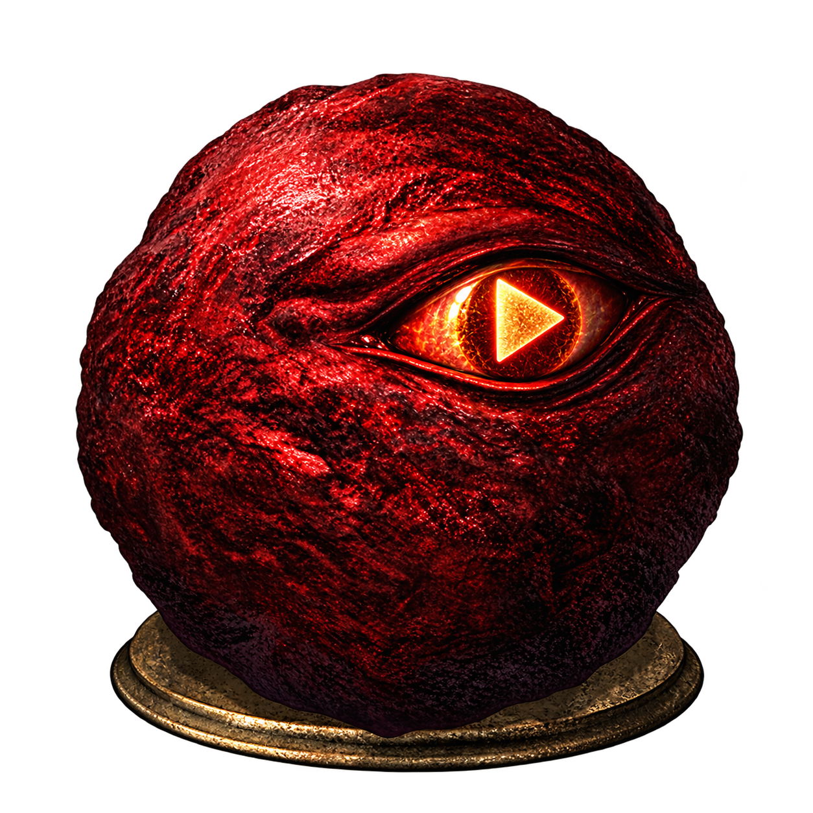
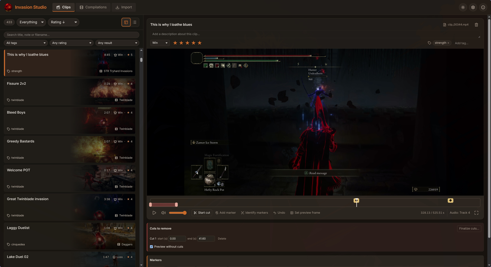
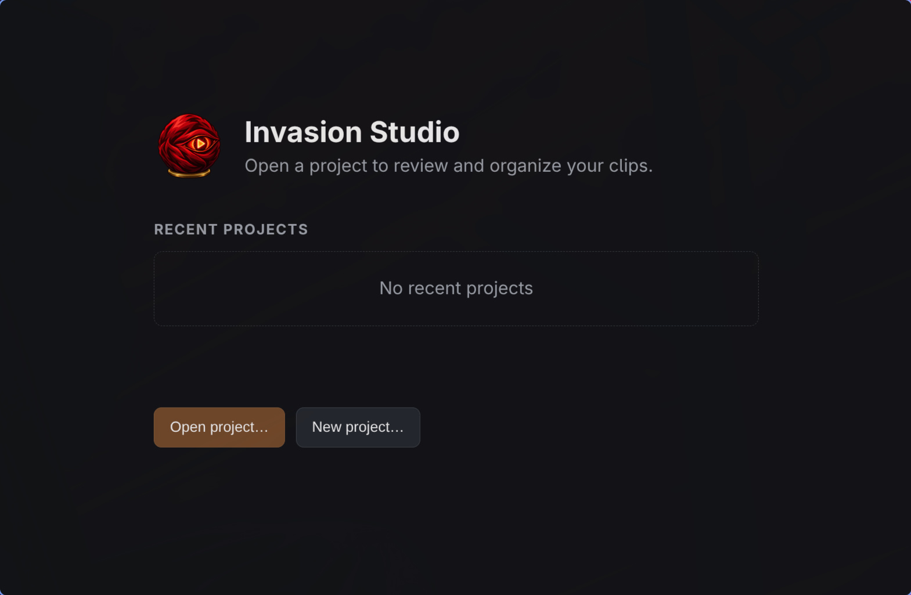
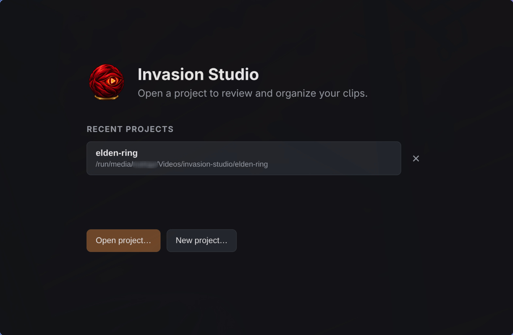
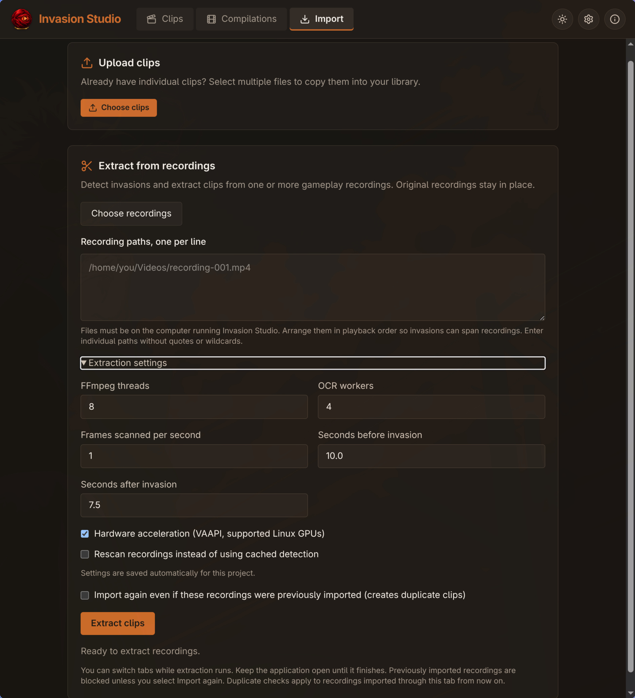
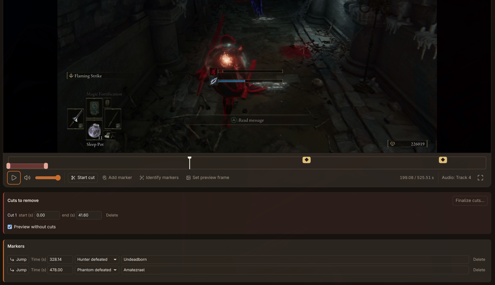
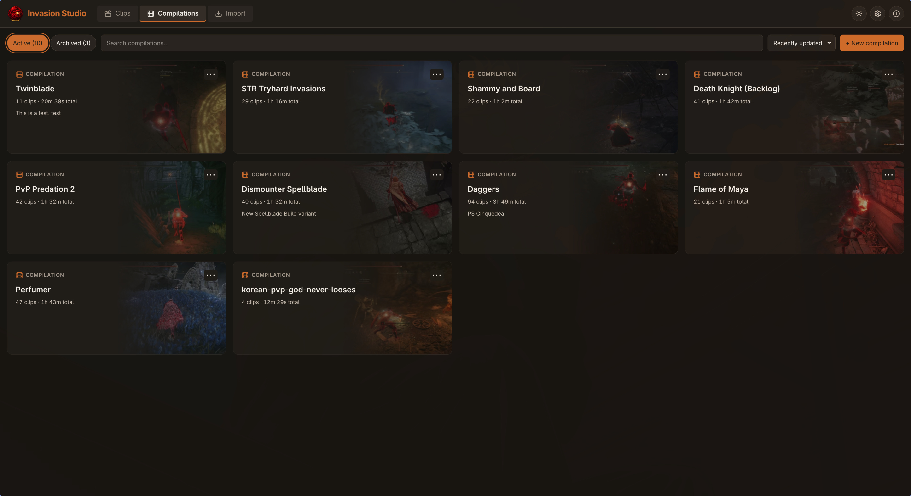
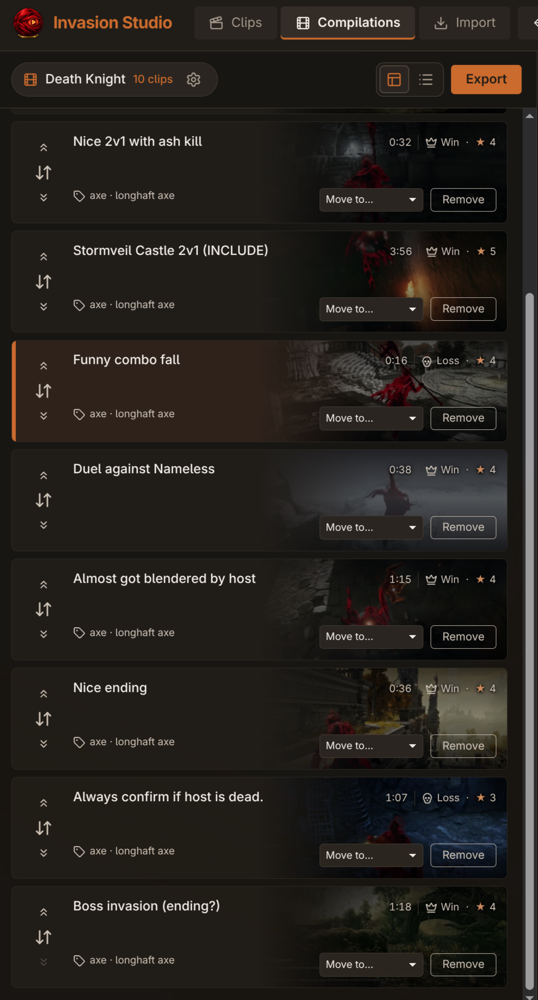
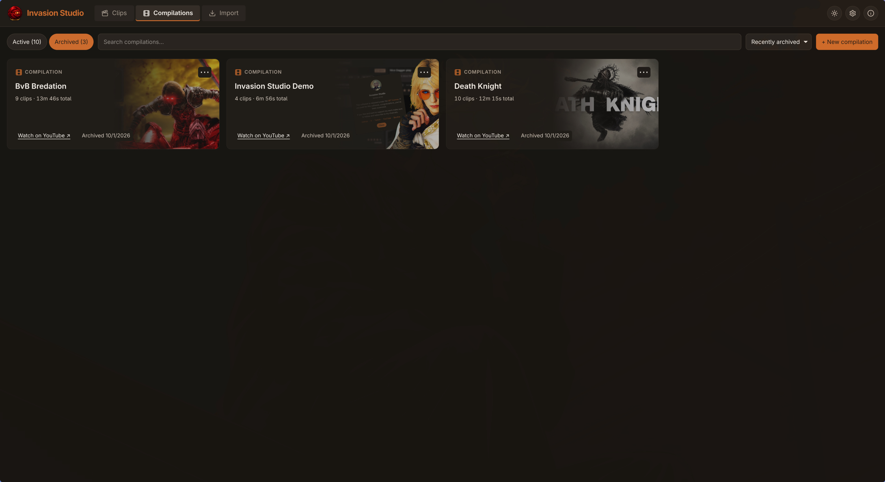
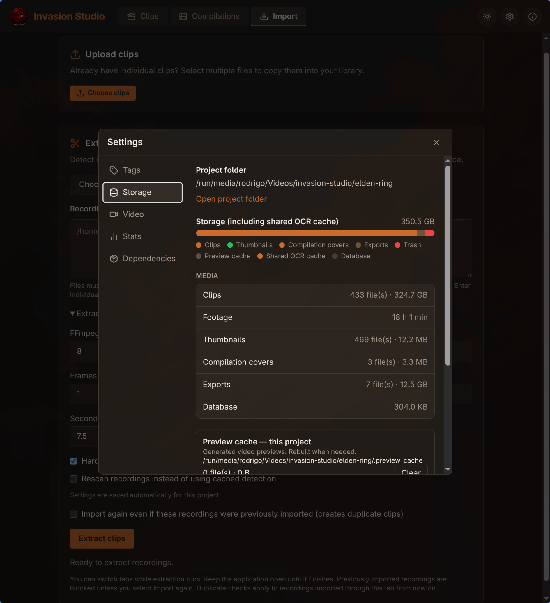

<p align="center">
  
</p>
<h1 align="center">Invasion Studio</h1>
<p align="center">Turn Elden Ring recordings into clips worth sharing.</p>

## Contents

1. [Introduction](#introduction)
2. [Installation](#installation)
3. [Projects and storage](#projects-and-storage)
4. [Importing videos](#importing-videos)
5. [The Clips tab](#the-clips-tab)
6. [The video editor](#the-video-editor)
7. [Compilations and export](#compilations-and-export)
8. [Settings](#settings)
9. [Command-line tools](#command-line-tools)
10. [Development and contributions](#development-and-contributions)
11. [Troubleshooting](#troubleshooting)
12. [Donation and support](#donation-and-support)
13. [License](#license)

## Introduction

Invasion Studio is a local desktop app for reviewing, organizing and preparing
Elden Ring gameplay for videos. Import finished clips or let it find invasions
and arena encounters in longer recordings, then tag your favourites, remove
unwanted sections and assemble compilations for editing in Kdenlive.

Your library stays on your computer. No account or cloud upload is required.
The usual workflow is **Create a project → Import → Review and edit → Compile → Export**.



## Installation

| Platform | Status | Installation |
|---|---|---|
| Linux x64 | v0.8.0 local release candidate | Flatpak; instructions below |
| macOS | **Pending — not yet tested for v0.8.0** | Desktop installer not available yet |
| Windows | **Pending — not yet tested for v0.8.0** | Desktop installer not available yet |

### Linux desktop

Install Flatpak and configure the Flathub remote using your distribution's
package manager or software centre. Once you have the `.flatpak` release file,
install and launch it:

```bash
flatpak install --user ./invasion-studio-0.8.0-linux-x64.flatpak
flatpak run com.bladeofmaya.InvasionStudio
```

The package includes Electron, Ruby, FFmpeg/ffprobe, Tesseract and English OCR
data. You do not need to install those separately. Flatpak obtains the required
Freedesktop runtime during installation; afterwards the app works offline.
Kdenlive is a separate, optional installation for opening exported projects.

The app can access your home directory and mounted drives for projects and
recordings. To update from another bundle, close the app first:

```bash
flatpak install --user --reinstall ./invasion-studio-0.8.0-linux-x64.flatpak
```

Public release hosting is not finalized. For building your own candidate, see
[Development](#development-and-contributions). Remaining release acceptance
checks are documented in [RELEASING.md](RELEASING.md).

### Alternative: Ruby gem and browser UI

The standalone gem provides the CLI and the same interface in a browser.
It requires Ruby **3.3.3 or newer**, FFmpeg/ffprobe and Tesseract with English
language data. Development uses the versions pinned in `mise.toml`.

Example Linux dependency installation:

```bash
# Debian / Ubuntu
sudo apt-get install ffmpeg tesseract-ocr tesseract-ocr-eng

# Arch Linux
sudo pacman -S ffmpeg tesseract tesseract-data-eng
```

Then install and start the gem:

```bash
gem install invasion-studio
invasion-studio webui /path/to/project
```

Open **http://localhost:4567**. Use `webui --port 8080 /path/to/project` to choose
another port. Ruby itself is installed separately; native gem dependencies may
also need a compiler toolchain. This alternative does not imply tested macOS or
Windows support for v0.8.0.

## Projects and storage

A **project** is your library folder. A **compilation** is an ordered selection
of clips inside that library, usually intended to become one finished video.
You can keep multiple compilations in one project.

### Create or open a project

1. Launch Invasion Studio and choose **New project…**.
2. Create or select a folder with enough space for your clips and exports.
3. Choose **Use this folder**. The app initializes the library there.
4. Open **Import** to add footage.

Use **Open project…** for an existing library. A new project includes an initial
compilation named **Video 1**, which you can rename or replace.

<p align="center">
  
</p>

Previously opened folders appear under **Recent projects**. Click one to reopen
it, or use the **×** beside it to remove it from the list. Removing an entry
keeps its folder and files; opening that folder again adds it back. Missing
folders are removed from the list automatically.

<details>
<summary>Screenshot: recent projects</summary>



</details>

### What the project stores

Folders are created as needed:

```text
my-project/
├── project.db        Clip metadata, tags, compilations, cuts, markers and project settings
├── clips/            Uploaded clips and clips extracted into this project
├── thumbnails/       Generated or manually selected clip previews
├── covers/           Custom compilation thumbnails
├── exports/          Exported videos and Kdenlive projects
├── .trashed/         Deleted clips that can still be restored
├── .backup/          Original clip copies saved when finalizing cuts
└── .preview_cache/   Temporary playback previews, rebuilt when needed
```

Videos remain ordinary files. Titles, descriptions, ratings, results, tags,
compilation order and editing information live in the SQLite database. Keep
`project.db` with the videos: copying only the videos loses that organization.
Older `project.json` libraries are migrated on first open. Video files placed in
the project root by hand are discovered when the library starts.

Close the app before backing up or moving a project, then copy the **whole
folder**, including hidden folders. Reopen it at its new location. Original
long recordings used for extraction remain where you selected them; they are
not copied into the project.

Some data lives outside projects: launcher history, machine preferences and
the shared OCR cache. Flatpak stores its application data under
`~/.var/app/com.bladeofmaya.InvasionStudio/`. The standalone app follows XDG
locations, including `~/.config/invasion-studio/` for configuration and
`~/.cache/invasion-studio/` for OCR results. **Settings → Storage** shows the
actual project and cache paths.

## Importing videos

The **Import** tab offers two ways to add footage:

| Method | Use it for | What happens |
|---|---|---|
| **Upload clips** | Individual clips you have already cut | Copies the files into the library |
| **Extract from recordings** | Long gameplay recordings or saved streams | Scans game messages and creates a clip for each detected encounter |

### Upload existing clips

Choose **Upload clips → Choose clips** and select one or several files.
Supported file extensions are `.mp4`, `.mkv`, `.mov`, `.avi`, `.webm`, `.flv`,
`.m4v`, `.mpeg` and `.mpg`, with a maximum of **4 GB per uploaded file**.
Playback support also depends on the codecs inside the file.

Files are checked with ffprobe, copied into `clips/`, registered in the database
and given preview thumbnails in the background. Originals remain untouched.
Invalid files are reported individually so the remaining uploads can continue.

### Extract encounters from recordings

1. Choose **Extract from recordings → Choose recordings** in the desktop app.
2. Check the **Recording paths** box. Use one path per line, in playback order.
3. Adjust **Extraction settings** if needed.
4. Choose **Extract clips** and follow the progress indicator.
5. Choose **View imported clips** when the job finishes.

For recordings split across files, submit them together in chronological order.
An encounter spanning two files can then become one clip. The picker initially
sorts by filename/path; edit the order if that is not chronological.

In the browser interface, enter paths on the computer running Invasion Studio.
The path box takes individual filenames **without quotes or wildcards**.
This processes recordings already on disk; it does not capture a live stream.

<details>
<summary>Screenshot: import and extraction settings</summary>

<p align="center">
  
</p>

</details>

### Extraction options

These settings save automatically for the current project. Defaults below apply
to a new project; screenshots may show customized values.

| Setting | Default | What it controls |
|---|---|---|
| **FFmpeg threads** | `4` | Thread setting passed to FFmpeg; allowed range `1–64` |
| **OCR workers** | Up to `4`, limited by CPU count | Parallel text-recognition workers; allowed range `1–64`. More workers use more CPU |
| **Frames scanned per second** | `1` | OCR sampling rate, `1–10`. Higher values can catch shorter messages but increase work |
| **Seconds before invasion** | `10` | Extra footage before the detected start, `0–3600` seconds |
| **Seconds after invasion** | `7.5` | Extra footage after the detected end, `0–3600` seconds |
| **Hardware acceleration** | Off | Use VAAPI for frame extraction on supported Linux GPUs. This is separate from player decoding |
| **Rescan recordings instead of using cached detection** | Off | Reprocess the recordings without reusing or writing the OCR cache |
| **Import again…** | Off | Allow recordings already imported through this project's Import tab, creating another set of clips |

The job runs in the background, so you can change tabs and return to it. Keep
the application open until it finishes: extraction does not resume after
shutdown, and only one GUI extraction runs at a time per project.

Before extraction, a SHA-256 content check detects previously imported
recordings, including renamed copies. A batch containing a previous import is
rejected as a whole unless **Import again** is enabled. Partial imports are
also guarded. This history covers GUI extractions recorded by this feature;
it does not cover older imports, CLI extraction or ordinary clip uploads.

### How detection works

OCR reads the game's English encounter messages:

| Event | Recognized message |
|---|---|
| Encounter starts | `Defeat … Host of Fingers` or `Commencing combat` |
| Encounter ends | `Returning to your world` or `Combat ends` |

Padding includes the moments around these messages. Menus, overlays, unusual
capture layouts or unreadable text can affect detection. Review the resulting
clips and adjust them in the editor. Automatic death markers are explained
[below](#automatic-death-markers).

## The Clips tab

Select a clip in the list to preview it and edit its details. The selected row
is highlighted. Drag the divider to give more space to the list or player.
Use the **Extended / Compact** icons for image-backed rows or a denser list.
Pane width and compact mode are saved per project.

### Find and organize footage

| Control | Purpose |
|---|---|
| **Everything / Unassigned / Assigned / Trash** | Browse the library by compilation membership or deletion state |
| **Search** | Find clips by title, description or filename |
| **Tag filter** | Show a specific tag or only untagged clips |
| **Rating filter** | Show a minimum star rating or unrated clips |
| **Result filter** | Show wins, losses, disconnects or clips without a result |
| **Sort** | Default order, newest, oldest, rating, title, longest or shortest |
| **Filter chips / Clear filters** | Remove individual search constraints or clear them together |

The initial view is **Unassigned**. Switch to **Everything** if a clip seems
missing after assigning it to a compilation. Your filters, sort order and last
selected clip are remembered when switching tabs within the current session.
Use **J / K** to select the next or previous clip when you are not typing in a field.

### Clip details

Give each clip a recognizable **title** and an optional **description**. Set a
**1–5 star rating**, choose **Win**, **Loss** or **DC**, and use **Add tag…** for
builds, weapons or themes such as `twinblade`, `duel` or `funny`.
These details save automatically; leave a text field to save its changes.

Use the compilation control on a list entry to assign it to a compilation.
Assigned entries show their compilation name, which opens that collection.
The filename link in the editor reveals the clip in your file manager.

### Trash and restore

The trash icon in the editor moves a clip to the project's trash. Select
**Trash** in the list filter to restore it. **Empty trash** permanently removes
the trashed media and thumbnails after confirmation. Removing a clip from a
compilation is a separate action and keeps it in the library.

## The video editor

Playback and editing share the timeline directly beneath the video. Play or
pause, adjust volume, seek, and use **Fullscreen editor** for more room.
The audio label shows the track selected in **Settings → Video**; there is no
track switcher in the player.



### Remove unwanted sections

1. Seek to the beginning of the unwanted section and choose **Start cut**.
2. Seek to its end and choose **End cut here**.
3. Adjust the highlighted range by dragging its boundaries or editing the
   start/end seconds under **Cuts to remove**.
4. Enable **Preview without cuts** to skip marked sections during playback.
5. Repeat for other sections. Use **Delete** on a range to keep that section,
   or **Undo** to undo a recent timeline edit.
6. Choose **Finalize cuts…** when you are satisfied.

Until finalization, cut ranges are saved editing instructions and the clip file
is unchanged. Finalization writes the shortened clip and keeps the previous
file in `.backup/`. It clears the applied ranges, removes markers inside cut
sections and shifts the remaining markers to their new times.

**Finalize cuts before exporting a compilation.** Export currently joins the
stored clip files; it does not apply pending cut ranges. Cutting uses stream
copy, so exact boundaries can depend on the recording's keyframes.

### Add and edit markers

Seek to an event and choose **Add marker**. Give it a label and event type,
then adjust its timestamp directly or drag it along the timeline. **Jump**
returns playback to that marker. Manual types include custom events, invasion
start/end, and defeated host, phantom, hunter or invader.

Markers and cuts save automatically. If a save fails, use the displayed retry
action before finalizing or leaving the clip.

### Automatic death markers

New extractions detect these death banners. Use **Identify markers** to scan an
existing clip with the project's extraction settings:

| Banner | Marker type |
|---|---|
| `Furled Finger … has died` | Phantom defeated |
| `Hunter … has died` | Hunter defeated |
| `Bloody Finger … has died` | Invader defeated |
| `Recusant … has died` | Invader defeated |

The detected player name becomes the marker label. Because the banner usually
appears after the death animation, markers are placed **eight seconds before
the first detected banner**, clamped to the clip start. This estimates the death
time; OCR sampling and banner timing prevent frame-exact detection. Adjust
markers manually when necessary.

Repeated sightings are grouped into one event. Rescanning merges detections
and preserves existing marker positions, including manual adjustments. Keep
the app open during identification.

### Choose the library preview

Seek to a representative frame and choose **Set preview frame**. The clip's
list thumbnail updates after capture. A failed capture preserves the old image.

For more editing details, see [the video editor guide](docs/video-editor.md).

## Compilations and export

A compilation is an ordered collection of clips for a finished video: for
example, a weapon showcase, a stream highlight reel or a PvP montage. It stores
membership and ordering without making another copy of each clip.



### Build and sort a compilation

1. Open **Compilations → + New compilation** and give it a name.
2. Add clips using their compilation controls in the Clips tab.
3. Open the compilation to review its sequence.
4. Drag a clip's reorder handle, or use **Move to top / Move to bottom**.
5. Use **Move to…** to transfer a clip to another compilation, or **Remove** to
   remove its membership while keeping the clip in the library.

The **Extended / Compact** toggle works here too. The gear beside the clip count
opens compilation settings. On the overview, search by title or description and
sort by name or recent updates. Cards summarize clip count and duration after
saved cuts; pending cuts still need finalizing before export.

<details>
<summary>Screenshot: ordering clips inside a compilation</summary>

<p align="center">
  
</p>

</details>

### Export to Kdenlive

Finalize any pending cuts, arrange the clips in your preferred order, then
choose **Export**. The app creates:

```text
exports/My Compilation/
├── My Compilation.mp4        Combined video with clip chapters
└── My Compilation.kdenlive   Kdenlive timeline project
```

Open the `.kdenlive` file in **Kdenlive 26.04 or newer** and continue editing.
Keep the combined video with the project so the editor can locate its media.
Existing exports require overwrite confirmation. A folder-reveal action becomes
available after export.

Kdenlive is the current editor-project export target. Support for other editing
tools is planned; there is no release date yet. The combined MP4 can also be
imported into another editor directly.

### Covers, YouTube links and archiving

Use **⋯ → Edit details…** on a compilation card, or its settings gear, to edit
the title, description, final YouTube URL and cover image. Covers accept
**PNG, JPEG or WebP up to 10 MB**. They are copied into `covers/`; without a
custom cover, the compilation uses a clip thumbnail. Click the cover preview
in the dialog to inspect it at a larger size.

When a video is finished, choose **⋯ → Archive…**. You can attach the published
YouTube link and the thumbnail you used, or archive without them. Archived
compilations appear in the **Archived** tab, with **Watch on YouTube ↗** when a
link is present. This records publication details; it does not upload to YouTube.

**Restore to active** brings a compilation back with its details intact.
Archiving keeps all clips. Deleting a compilation removes its metadata and
custom cover but keeps the clips in your library.



## Settings

Open the **gear in the top-right app header**. The sun/moon button beside it
switches between light and dark mode.

| Section | What you can view or change |
|---|---|
| **Tags** | View tags and usage counts; rename or delete tags across this project. Create tags from a clip's **Add tag…** field. Deleting a tag removes its associations, not the clips |
| **Storage** | View the project path, open its folder in the desktop app, inspect media/cache usage and footage duration, clear caches, or permanently empty the trash |
| **Video** | Set **Audio tracks per clip** (`1–32`) and the **Default audio track**, then choose **Save**. The track count also informs Kdenlive export; it does not add tracks to recordings |
| **Stats** | View encounter count, total time, win rate and result totals. This page is read-only; change clip results in the editor. Disconnects are excluded from win rate |
| **Dependencies** | Inspect FFmpeg, ffprobe and Tesseract paths. Set an absolute custom executable path with **Apply**, or reset with **Use detected** |

<details>
<summary>Screenshot: Storage settings</summary>

<p align="center">
  
</p>

</details>

**Preview cache** belongs to the current project and is rebuilt when needed.
**OCR cache** is shared across projects; clearing it requires confirmation and
means future detection must rescan recordings. Storage totals include that
shared cache. Neither cache-clear action deletes library clips.

Video and extraction settings belong to the project. Extraction settings live
on the **Import** screen. Dependency overrides are machine-wide and also apply
to the standalone CLI. Tool selection uses a custom path first, then
`INVASION_STUDIO_FFMPEG`, `INVASION_STUDIO_FFPROBE` or
`INVASION_STUDIO_TESSERACT`, then the system `PATH`. The Dependencies screen
checks executable availability, not codec support.

## Command-line tools

From a source checkout, use `bin/invasion-studio`. After installing the gem,
use `invasion-studio` with the same arguments. The desktop Flatpak does not
install a host CLI command.

| Command | Example | Purpose |
|---|---|---|
| `extract` | `bin/invasion-studio extract --project /path/to/project recording.mp4` | Detect encounters, create clips and register them in the project |
| `scan` | `bin/invasion-studio scan recording.mp4` | Show detected encounters without generating clips |
| `import` | `bin/invasion-studio import --project /path/to/project clip.mp4` | Copy existing clips into a project |
| `webui` | `bin/invasion-studio webui /path/to/project` | Start the browser UI on port 4567 |
| `concat` | `bin/invasion-studio concat /path/to/project/clips` | Join a folder's videos into `combined.mp4` with chapters |
| `export-kdenlive` | `bin/invasion-studio export-kdenlive /path/to/project/clips` | Export a folder's videos as combined media and a Kdenlive project |
| `normalize` | `bin/invasion-studio normalize --dry-run /path/to/project` | Preview sequential clip renaming; omit `--dry-run` to apply it. Stop the app first |

The folder-based `concat` and `export-kdenlive` commands use filename order.
Use the GUI's **Export** action for a compilation's saved order. Both CLI
commands accept `-o FILE` to change their output path.

### Extraction flags

`extract` is the default command. Pass multiple recordings in chronological order:

```bash
bin/invasion-studio extract --project ~/Videos/ER/my-project \
  ~/Videos/recording-001.mp4 ~/Videos/recording-002.mp4
```

| Option | Default | Purpose |
|---|---|---|
| `--project DIR` | None | Write into `clips/` with sequential names and database registration |
| `-o, --outdir DIR` | `./invasion_clips` | Write clips to a standalone output folder |
| `-p, --prefix NAME` | `invasion` | Filename prefix for standalone extraction |
| `--fps RATE` | `1` | OCR samples per second |
| `--pad-start SEC` | `10` | Padding before detection |
| `--pad-end SEC` | `7.5` | Padding after detection |
| `--ffmpeg-threads N` | `4` | FFmpeg thread setting |
| `--ocr-workers N` | Up to `4` | Parallel OCR workers |
| `--ocr-batch-size N` | `1` | Images per Tesseract process; advanced throughput tuning |
| `--hwaccel` | Off | Enable VAAPI frame extraction where supported |
| `--no-cache` | Off | Disable reading and writing OCR cache |
| `--continue-on-error` | Off | Continue after an input-processing error |
| `-d, --debug` | Off | Print matches and write frame OCR diagnostics to YAML |
| `-q, --quiet` | Off | Suppress non-error output |

`--project` cannot be combined with explicit `--outdir` or `--prefix` options.
For command-specific details, run `bin/invasion-studio COMMAND --help`.
Use `--version` for the installed version.

## Development and contributions

The backend is Ruby/Sinatra with SQLite persistence. The UI uses Stimulus,
Tailwind and Video.js, with Electron providing the desktop shell. Ruby and
Node.js versions are pinned in [mise.toml](mise.toml).

### Set up and iterate

Clone your fork, enter the checkout, and install mise plus the host media tools
listed under [Installation](#installation). Then run:

```bash
bin/setup
bin/dev /path/to/disposable-project

# Or iterate in a browser:
bin/dev --browser /path/to/disposable-project
```

`bin/setup` installs the pinned toolchain, gems and frontend/Electron dependencies.
Without a project argument, `bin/dev` uses `tmp/dev-project`. Use disposable data:
development edits affect the selected project. Electron development has separate
launcher history/window settings, but the backend still uses normal user settings
and host FFmpeg/Tesseract.

CSS/JavaScript changes rebuild and reload automatically. Templates trigger a
reload; Ruby changes restart the backend. Electron shell changes restart the
development window. Reloading resets playback and may discard unsaved fields.
Browser mode defaults to port 4567; `STUDIO_DEV_PORT` overrides it. Ctrl+C stops
the app and watchers. Rerun `bin/setup` after dependency lockfile changes.

| Tool | Purpose |
|---|---|
| `bin/dev console` | Open a Ruby/Pry console |
| `bin/dev icon` | Regenerate desktop icons from `desktop/electron/assets/logo.png`; requires ImageMagick 7 |
| `bin/test` | Run non-video Ruby, frontend and Electron tests |
| `bin/test --browser` | Build assets and run Chromium UI smoke checks with a temporary project and media disabled |
| `bin/release` | Build the Linux x64 Flatpak and stage release materials |
| `bin/release --install` | Build and install/reinstall the Flatpak for the current user |
| `bin/release --gem` | Build the standalone Ruby gem and stage release materials |
| `bin/release --gem --install` | Also install the gem locally |
| `bin/release version patch` | Update version metadata; also accepts `minor`, `major` or an explicit version |

### Build and verify packages

Linux desktop builds additionally require Python 3, ImageMagick 7, a C compiler,
make, curl, sha256sum, Flatpak, flatpak-builder and elfutils (`eu-strip`), plus
Freedesktop Platform/SDK and Electron BaseApp **26.08**.

Close the installed app before `bin/release --install`. Artifacts are staged in
`pkg/release/<version>/desktop/` and `pkg/release/<version>/gem/`, with checksums
and notices. Builds do not run tests, create tags or publish releases.

```bash
bin/test --packaged       # Built backend: empty-project checks
bin/test --installed      # Installed Flatpak: temporary-project checks
bin/test --release        # Non-video suites, isolated gem installation and backend checks
```

The release gate requires a current desktop build, a clean checkout and network
access. `ALLOW_DIRTY=1` is available for local development only. The browser smoke
check needs a graphical session or virtual display.

Real-media checks are separate and should be run manually:

```bash
bin/test --video          # Video integration suite
bin/test --media-package  # Packaged sample-media check
```

See [RELEASING.md](RELEASING.md) for prerequisites, release acceptance and
redistribution review. Private build helpers live in `script/`.

### Send a pull request

Create a branch in your fork, make a focused change, and describe the problem and
resulting behaviour in your pull request. Add regression coverage for behaviour
changes and include the checks you ran. For UI changes, include screenshots in
light and dark mode and check a narrow layout.

Use `bin/dev` for iteration rather than rebuilding the desktop package. Do not
commit generated frontend assets, build output or personal project data.
See [AGENTS.md](AGENTS.md) for architecture and contributor guidance.

## Troubleshooting

| Problem | Check |
|---|---|
| A clip seems missing | Switch from **Unassigned** to **Everything**, clear filters, and check **Trash** |
| A recent project disappeared | Reconnect its drive, then use **Open project…**; removing a recent entry never deletes its files |
| Extraction misses encounters | Confirm English game text is visible, check recording order, rescan without cache, or inspect CLI `--debug` output |
| Recording import is blocked as a duplicate | Check whether the recording was previously or partially imported; use **Import again** only when you want another set of clips |
| Playback has the wrong audio | Check **Settings → Video → Default audio track** and the label in the player |
| A media tool cannot be found | Inspect **Settings → Dependencies**; development and gem installations use host tools |
| Export still contains unwanted footage | Finalize the clip's cuts, then export the compilation again |
| Disk usage is growing | Inspect **Storage**, exports, trash and `.backup/`; preview/OCR caches can be cleared separately |

For a bug report, include the application version, OS, installation method,
steps to reproduce and the error message. For media issues, include the file's
container, codecs and audio-track count. Share footage only if you are comfortable
making it available.

## Donation and support

If Invasion Studio saves you time, you can support its development on Ko-fi:

[](https://ko-fi.com/bladeofmaya)

Bug reports, suggestions and pull requests are welcome through the repository's
issue tracker. For streams, videos and project updates:

- [Twitch — Blade of Maya](https://www.twitch.tv/bladeofmaya)
- [YouTube — Blade of Maya](https://www.youtube.com/@bladeofmaya)

## License

Invasion Studio is released under the [MIT License](MIT-LICENSE).
Bundled dependencies have their own licenses; see
[Third-party licenses](THIRD_PARTY_LICENSES.md).
