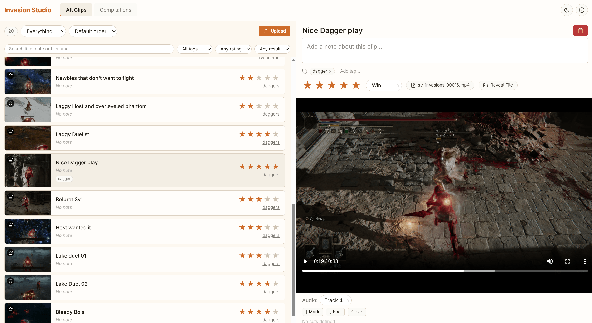
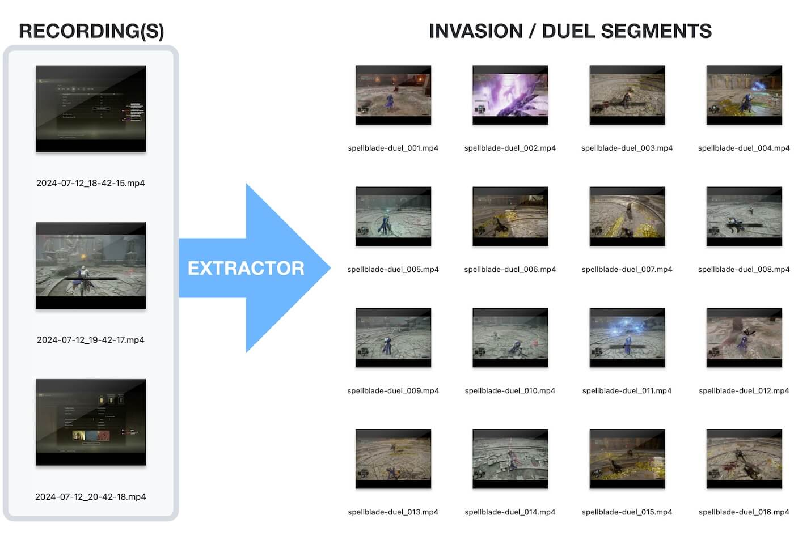

# Elden Ring Invasion Studio

Invasion Studio finds invasions and arena encounters in Elden Ring recordings,
extracts them as individual clips, and provides a local WebUI for reviewing,
organizing, trimming, and exporting them. Clips cut elsewhere can be uploaded
straight into the WebUI, so the library is not limited to extractor output.



## Desktop installation (Linux x64)

The v0.8.0 desktop package is a Flatpak containing Electron, the Ruby backend,
FFmpeg/ffprobe, Tesseract, and English OCR data. You do not need Ruby, Node.js,
FFmpeg, or Tesseract installed on the host. Flatpak installs the required
Freedesktop 26.08 runtime separately.

Download the `.flatpak` release artifact, then install and launch it:

```bash
flatpak install --user ./invasion-studio-0.8.0-linux-x64.flatpak
flatpak run com.bladeofmaya.InvasionStudio
```

A configured Flathub remote is needed to obtain the runtime. The app works
offline after installation. Open or create a project in the launcher, then use
**Import** to upload existing clips or extract encounters from recordings.
Windows and macOS desktop installers are not part of v0.8.0.

The Flatpak has access to your home and mounted drives so you can select project
folders and recordings. It stores preferences under
`~/.var/app/com.bladeofmaya.InvasionStudio/`; clips and metadata remain in your
chosen project folder. Back up that whole folder before upgrading.

## Ruby gem installation (alternative)

The standalone CLI/WebUI requires Ruby 3.3.3 or newer, FFmpeg, and Tesseract OCR
with English language data. These dependencies are supplied automatically only
in the desktop Flatpak:


```bash
# macOS
brew install ffmpeg tesseract

# Ubuntu/Debian
sudo apt-get install ffmpeg tesseract-ocr

# Arch Linux
sudo pacman -S ffmpeg tesseract tesseract-data-eng
```

Install the gem:

```bash
gem install invasion-studio
```

## Quick usage

The normal workflow has two steps.

### 1. Generate clips into a new folder

Choose a new output folder and pass one or more gameplay recordings:

```bash
invasion-studio extract \
  --outdir ~/Videos/ER/my-invasion-project \
  ~/Videos/Capture/*.mp4
```

The output folder is created automatically. Each detected encounter becomes an
MP4 clip inside it.

Once a project exists, later extractions can target it directly:

```bash
invasion-studio extract \
  --project ~/Videos/ER/my-invasion-project \
  ~/Videos/Capture/*.mp4
```

`--project` writes the clips into the project's `clips/` folder as
`clip_00022.mp4`, `clip_00023.mp4`, ... (continuing from the highest existing
number) and registers them in `project.db` right away, with the source
recording stored as provenance. Thumbnails are generated the next time the
WebUI starts.

If OBS split one recording into several files, pass them together in
chronological order. Invasions spanning two files are joined automatically.



### 2. Start the WebUI with that folder

```bash
invasion-studio webui ~/Videos/ER/my-invasion-project
```

Open [http://localhost:4567](http://localhost:4567). All project metadata
lives in a SQLite database (`project.db`) inside the selected folder; projects
created by versions before 0.6.0 (`project.json`) are migrated automatically
the first time they are opened.

From the WebUI you can:

- preview clips using the audio track selected in Settings, shown as a label in the player;
- add titles, notes, ratings, results, and tags;
- search the library and filter by tag, rating, or result;
- upload clips and extract invasions from longer recordings in the Import tab;
- organize clips into compilations and reorder them by drag & drop;
- mark unwanted sections for removal;
- move clips to the trash, restore them, or empty the trash for good;
- export a compilation as a combined video and Kdenlive project.

To use another port:

```bash
invasion-studio webui --port 8080 ~/Videos/ER/my-invasion-project
```

Desktop launchers can request an OS-selected port and monitor their sidecar:

```bash
invasion-studio --quiet webui --port 0 --parent-pid "$launcher_pid" ~/Videos/ER/my-invasion-project
```

Once listening, the command writes a JSON line such as
`{"event":"ready","port":49152}` to standard output. `GET /api/health`
returns the application version and current project state. SIGTERM shuts the
server down cleanly, and `--parent-pid` stops it if its launcher disappears.

Packaged applications may set `INVASION_STUDIO_FFMPEG`,
`INVASION_STUDIO_FFPROBE`, and `INVASION_STUDIO_TESSERACT` to absolute tool
paths. When unset, the usual `PATH` lookup is used.

## Project folder layout

A project is a plain folder. Everything Invasion Studio knows about it lives
inside:

```text
my-invasion-project/
├── clips/            clips added through the WebUI upload
├── thumbnails/       generated preview thumbnails
├── exports/          combined videos and Kdenlive projects
├── .trashed/         clips moved to the trash (until the trash is emptied)
└── project.db        SQLite database: titles, notes, ratings, tags,
                      compilations, cut markers
```

The video files stay ordinary files — deleting `project.db` loses the metadata
but never the clips. Video files copied into the folder by hand are picked up
the next time the WebUI starts.

### Uploading clips

Open **Import → Upload clips → Choose clips** to select one or more video files
(`.mp4`, `.mkv`, `.mov`, `.avi`, `.webm`, `.flv`, `.m4v`, `.mpeg`, `.mpg`,
up to 4 GB each). Files are validated with ffprobe before they enter the
library, stored under `clips/`, and get a preview thumbnail generated in the
background. Files that fail validation are reported individually and the rest
of the batch is imported normally.

### Extracting recordings from the GUI

Open **Import → Extract from recordings**. In the desktop app, use **Choose
recordings** to select multiple local videos. In the browser WebUI, enter one
file path per line on the computer running Invasion Studio. Paths can also be
edited in the desktop app. Use individual paths without shell quotes or
wildcards, in playback order; the picker initially sorts by filename/path.

Under **Extraction settings**, set **FFmpeg threads** to `8` and enable
**Hardware acceleration** to match `extract --ffmpeg-threads 8 --hwaccel`.
The current project is always the destination. Frame rate, OCR worker count,
padding, and cache reuse are also configurable.

Extraction runs in the background, reports progress, and registers the new
clips with their source recording. You can change tabs or reload the page and
return to see its status. Keep the application open: this initial version
allows one GUI extraction at a time per project and does not resume jobs after
shutdown. Original recordings are read in place, and thumbnails/metadata are
queued after extraction.

Before extraction, a background SHA-256 content check reads each recording and
compares it with this project's persistent import history. Renamed or copied
recordings are recognized. A batch containing a previous import is rejected as
a whole, preserving recording order for encounters spanning multiple files.
**Import again** explicitly allows another set of clips. Partial or interrupted
runs are also guarded; failures before any clips are written can be retried.
This history covers new GUI extractions, not older imports or CLI extractions.
The content check adds disk reads, particularly noticeable for large recordings.

In **Settings → Storage**, the full project path is selectable and wraps to fit.
The desktop app also provides **Open project folder** using the native file
manager; the browser displays the path without a native folder-opening action.

Storage reports the current project's preview cache and the shared OCR cache
separately, with individual paths, sizes, and Clear buttons. Clearing OCR cache
affects all projects on this computer and requires confirmation. The storage
total includes this shared cache.

**Settings → Dependencies** shows the active and automatically detected FFmpeg,
FFprobe, and Tesseract paths and whether each is an executable file. Enter a full
custom path and choose **Apply**, or choose **Use detected** to reset it. These
machine-wide preferences persist in
`${XDG_CONFIG_HOME:-$HOME/.config}/invasion-studio/dependencies.json` and apply to
new tool invocations in the desktop app, WebUI, and CLI. Resolution order is
custom path, `INVASION_STUDIO_FFMPEG`/`INVASION_STUDIO_FFPROBE`/
`INVASION_STUDIO_TESSERACT`, then system `PATH`. Availability checks do not run
the binary or verify codec support.

## How detection works

The extractor samples the game-text area and uses OCR to find these messages:

- Start: `Defeat … Host of Fingers` or `Commencing combat`
- End: `Returning to your world` or `Combat ends`

Phantom and hunter death markers are placed eight seconds before the first OCR
detection of their death message, clamped to the start of the clip. This is an
estimate based on the game's delayed banner, not frame-exact death detection.
Markers can be adjusted manually; rescanning preserves existing marker positions.

Clips include 10 seconds before the detected start and 7.5 seconds after the
detected end by default.

## Other commands

```bash
# Show detected timestamps without creating clips
invasion-studio scan ~/Videos/Capture/*.mp4

# Join every clip in a folder and add chapter markers
invasion-studio concat ~/Videos/ER/my-invasion-project

# Build a combined video and Kdenlive project directly
invasion-studio export-kdenlive ~/Videos/ER/my-invasion-project

# Rename a project's clips to clip_00001.mp4, clip_00002.mp4, ...
# (updates the database, thumbnails, compilations, tags, and cuts;
#  stop the WebUI first, use --dry-run to preview)
invasion-studio normalize ~/Videos/ER/my-invasion-project

# Copy existing clips into a project as clip_00001.ext, clip_00002.ext, ...
invasion-studio import --project ~/Videos/ER/my-invasion-project ~/Videos/Clips/*.{mp4,mkv}

# Show global or command-specific help
invasion-studio --help
invasion-studio extract --help
```

Commands:

| Command | Purpose |
|---|---|
| `extract` | Detect encounters and create clips; this is the default command |
| `scan` | Detect encounters without creating clips |
| `webui` | Start the local project WebUI |
| `concat` | Join clips into one chaptered video |
| `export-kdenlive` | Create a combined video and Kdenlive timeline |
| `normalize` | Rename a project's clips to the generic sequential naming |
| `import` | Copy existing clips into a project with sequential naming |

## Useful extraction options

| Option | Default | Purpose |
|---|---:|---|
| `--outdir DIR` | `./invasion_clips` | Folder for generated clips |
| `--prefix NAME` | `invasion` | Generated filename prefix |
| `--project DIR` | — | Extract into a project (`clips/`, `clip_` prefix, DB registration); excludes the two options above |
| `--fps RATE` | `1` | OCR samples per second |
| `--pad-start SEC` | `10` | Extra time before an encounter |
| `--pad-end SEC` | `7.5` | Extra time after an encounter |
| `--no-cache` | off | Reprocess footage without reading or writing OCR cache |
| `--continue-on-error` | off | Continue when one input cannot be processed |
| `--debug` | off | Print matches and write frame OCR to YAML |
| `--ocr-workers N` | up to `4` | Parallel Tesseract workers |
| `--ocr-batch-size N` | `1` | Images handled by one Tesseract process |
| `--hwaccel` | off | Use VAAPI frame extraction when available |

Increasing `--fps` can help with very short messages but increases OCR work
linearly. `--ocr-batch-size 8` reduced CPU use by about 29% on the project test
videos, but improved elapsed time by only 1–2%; it remains an optional tuning
setting rather than the default.

## Cache and troubleshooting

OCR results are cached under:

```text
${XDG_CACHE_HOME:-$HOME/.cache}/invasion-studio
```

Use `--no-cache` when checking changed OCR settings or investigating a missed
encounter.

Detection can be missed when menus or platform overlays cover the game text.
Use `--debug` to inspect the recognized text and matched timestamps.

The extractor is optimized for English footage at 720p, 1080p, or 1440p on
macOS and Linux. A modern browser is required for the WebUI.

## Development

Ruby and Node.js are pinned in `mise.toml`. The five public entry points are:

| Command | Purpose |
| --- | --- |
| `bin/setup` | Install pinned tools, gems and frontend/Electron dependencies |
| `bin/dev [PROJECT]` | Run Electron against source Ruby with asset watching and UI reload |
| `bin/release [--install]` | Build a desktop release, optionally reinstalling it locally |
| `bin/test` | Run non-video Ruby, frontend and Electron tests |
| `bin/invasion-studio …` | Application CLI: extraction, scanning, WebUI and exports |

### Fast UI development

```bash
bin/setup
bin/dev /path/to/project
# Or use a browser (prints the local URL):
bin/dev --browser /path/to/project
```

Without a project argument, development uses `tmp/dev-project`. Use a disposable
project when experimenting: development edits are real project changes. Electron
uses separate development window settings and Recents; the Ruby app still uses
its usual user settings and host FFmpeg/Tesseract tools.

`bin/dev` builds assets once, then watches CSS/JS. Templates and completed asset
changes reload the page automatically. Ruby changes restart the backend; in
Electron, Ruby or shell changes restart the development window. Reloads reset
playback and may discard unsaved fields. Browser mode keeps the same URL across
backend restarts; set `STUDIO_DEV_PORT` to override port 4567.

There is no packaging, dependency installation or test execution during `dev`.
Rerun `bin/setup` after changing dependency lockfiles. Ctrl+C stops the app and
watchers. Host FFmpeg/ffprobe and Tesseract are required for media operations.

```bash
bin/dev console    # Ruby/Pry console
bin/dev icon       # Regenerate app icons from desktop/electron/assets/logo.png
```

Icon generation uses ImageMagick 7 (`magick`) and preserves aspect ratio and
transparency. Desktop release builds regenerate the icon automatically.
Generated frontend assets are ignored and must not be committed.

### Build and reinstall

```bash
bin/release                 # Linux x64 Flatpak plus release materials
bin/release --install       # Build, then install/reinstall for the current user
bin/release --gem           # Standalone Ruby gem plus notices/checksums
bin/release --gem --install # Build and install the gem locally
bin/release version patch  # Or minor, major, or an explicit version
```

Release folders are `pkg/release/<version>/desktop/` and
`pkg/release/<version>/gem/`. Each build replaces only its own generated target
folder after successful assembly; existing artifacts from other targets are
not silently mixed in. Builds do not run tests, tag commits or publish anything.

Desktop packaging currently supports **Linux x64 only**. Windows/macOS packaging
is not implemented. Build prerequisites include Python 3, ImageMagick 7, a C
compiler, make, curl, sha256sum, Flatpak, flatpak-builder and elfutils (`eu-strip`),
plus the Freedesktop SDK/Platform and Electron BaseApp 26.08. The Flatpak bundles
pinned media tools; source development and the standalone gem use host tools.

Close the installed app before reinstalling, then launch it with
`flatpak run com.bladeofmaya.InvasionStudio`. The gem's WebUI can be launched with
`invasion-studio webui /path/to/project`.

### Explicit verification

```bash
bin/test                  # Non-video Ruby + frontend + Electron suites
bin/test --packaged       # Empty-project backend checks after a desktop build
bin/test --installed      # Same checks inside the installed Flatpak
bin/test --release        # Non-video suites, isolated gem installation, backend check
bin/test --video          # Video integration suite: run manually
bin/test --media-package  # Sample-clip upload/probe/serving check: run manually
```

`--release` requires a current desktop build and a clean checkout; use
`ALLOW_DIRTY=1` only for local development. It needs network access to install
into an isolated gem environment. No tests run implicitly during development or
release builds. See [RELEASING.md](RELEASING.md) for the manual acceptance checklist.
Internal helpers live in `script/`; they are not the public command interface.

## Support

If this tool saves you time, consider supporting development:

[](https://ko-fi.com/bladeofmaya)

You can also follow me for Elden Ring streams, videos, and project updates:

- [Twitch](https://www.twitch.tv/bladeofmaya)
- [YouTube](https://www.youtube.com/@bladeofmaya)

Feel free to stop by and follow!

## License

MIT License — see [MIT-LICENSE](MIT-LICENSE).
